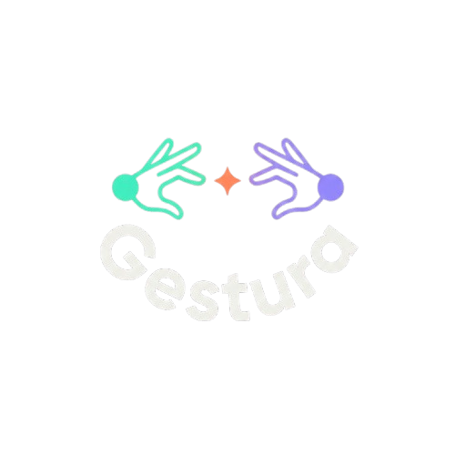

<p align="center">
  
</p>

<h1 align="center">Gestura</h1>

<p align="center">
  <strong>Real-time Indian Sign Language → Natural Sentences → Speech</strong><br/>
  Bridging the communication gap, entirely offline.
</p>

<p align="center">
  
  
  
  
  
</p>

---

## ✨ What is Gestura?

Gestura is an **end-to-end ISL communication system** that recognizes Indian Sign Language gestures from a phone camera and converts them into **natural spoken sentences** — all without any cloud API calls.

Unlike simple sign-to-word translators, Gestura accumulates multiple recognized signs and uses a **local language model** to form grammatically correct, natural-sounding sentences before speaking them aloud.

---

## 🔄 The Pipeline

```
┌─────────────┐     ┌──────────────────┐     ┌──────────────────┐
│  📱 Phone    │     │  🖥️ Server       │     │  📱 Phone        │
│  Camera      │────▶│  Recognition     │────▶│  Output          │
│  + MediaPipe │     │  + NLU           │     │  + TTS           │
└─────────────┘     └──────────────────┘     └──────────────────┘
```

### Step by Step

| Stage | What happens | Where |
|-------|-------------|-------|
| **1. Landmark Extraction** | MediaPipe Hand Landmarker detects 21 hand landmarks per hand at 30fps | Phone (in-browser) |
| **2. Gesture Capture** | Continuous auto-segmentation buffers landmark sequences as the user signs | Phone |
| **3. Frame Normalization** | Every sequence is normalized to exactly 45 frames (temporal sampling / padding) | Server |
| **4. ISL Recognition** | DTW template matching identifies each sign → `"HELP"`, `"WATER"` | Server |
| **5. Sign Accumulation** | Multiple recognized signs are collected into a buffer | Server |
| **6. Sentence Formation** | A local LLM (Ollama) transforms sign keywords into a natural sentence: `"HELP" + "WATER"` → *"Could you please give me some water?"* | Server |
| **7. Text-to-Speech** | The formed sentence is spoken aloud via on-device Web Speech API | Phone |

### Visual Pipeline

```
Hand Landmarks ──▶ ISL Recognition ──▶ Sign Buffer
                                          │
                                    "HELP" + "WATER"
                                          │
                                          ▼
                                   Local Language Model
                                    (Ollama / Gemma 2B)
                                          │
                                          ▼
                              "Could you please give me
                                   some water?"
                                          │
                                          ▼
                                    Text-to-Speech
                                    (on-device TTS)
```

---

## 🏗️ Architecture

```
┌─────────────────────────────────────────────────────────────────┐
│                        PHONE (Mobile Browser)                   │
│                                                                 │
│  ┌─────────────┐  ┌──────────┐  ┌────────┐  ┌───────────────┐ │
│  │ hand_tracker │  │ capture  │  │ network│  │  tts / asr    │ │
│  │ (MediaPipe)  │  │ (buffer) │  │ (HTTP) │  │ (Web Speech)  │ │
│  └──────┬──────┘  └────┬─────┘  └───┬────┘  └───────┬───────┘ │
│         └──────────────┘            │                │          │
└─────────────────────────────────────┼────────────────┼──────────┘
                                      │ HTTP (LAN WiFi)│
┌─────────────────────────────────────┼────────────────┼──────────┐
│                    EXPRESS PROXY (port 3000)          │          │
│              Serves UI + proxies /api/* ──────────────┘          │
└─────────────────────────────────────┬───────────────────────────┘
                                      │
┌─────────────────────────────────────▼───────────────────────────┐
│                      FLASK BACKEND (port 5000)                  │
│                                                                 │
│  Navigation Layer (thin routing)                                │
│  ┌──────────┐  ┌────────────┐  ┌───────────────┐  ┌─────────┐ │
│  │  /ping   │  │ /recognize │  │ /form-sentence│  │/templates│ │
│  └──────────┘  └─────┬──────┘  └───────┬───────┘  └─────────┘ │
│                       │                 │                        │
│  Tools Layer          ▼                 ▼                        │
│  ┌────────────────────────┐  ┌──────────────────────┐           │
│  │ landmark_normalizer.py │  │ sentence_former.py   │           │
│  │ dtw_matcher.py         │  │ (Ollama integration)  │           │
│  │ ai4bharat_inference.py │  └──────────────────────┘           │
│  └────────────────────────┘                                     │
└─────────────────────────────────────────────────────────────────┘
```

---

## 🤟 Supported Signs

| Category | Signs |
|----------|-------|
| **Greetings** | hello, thank you, sorry, please, how are you |
| **Common** | yes, no |
| **Emergency** | help, stop |
| **Basic Needs** | water, food, eat |
| **Descriptive** | good, bad |
| **Introduction** | my name |

> **15 signs** in the current vocabulary, expandable by recording new DTW reference templates.

---

## 🛠️ Tech Stack

| Component | Technology | Runs On |
|-----------|-----------|---------|
| Hand Tracking | MediaPipe Hand Landmarker | Phone (in-browser) |
| Sign Recognition | DTW (Dynamic Time Warping) | Laptop server |
| Sentence Formation | Ollama + Gemma 2B | Laptop server |
| Text-to-Speech | Web Speech API `speechSynthesis` | Phone (on-device) |
| Speech-to-Text | Web Speech API `SpeechRecognition` | Phone (on-device) |
| Server | Python (Flask) | Laptop |
| Phone UI | HTML / CSS / JavaScript | Phone browser |
| Connectivity | HTTP over local WiFi | LAN |

### Why These Choices?

- **MediaPipe in-browser** — zero server load for tracking, works on any modern phone
- **DTW over deep learning** — no training data needed, just record 3 reference templates per sign
- **Ollama** — runs any open-weight LLM locally, one-command install, REST API
- **Web Speech API** — fully on-device TTS/ASR, no network calls

---

## 🚀 Quick Start

### Prerequisites

- Python 3.9+
- Node.js 18+
- [Ollama](https://ollama.ai) installed on the laptop
- Phone and laptop on the same WiFi network

### Setup

```bash
# 1. Clone and install
git clone https://github.com/your-team/gestura-prototype.git
cd gestura-prototype

# 2. Install Python dependencies
cd server
pip install -r requirements.txt

# 3. Install Node dependencies
cd ..
npm install

# 4. Pull the local language model (one-time, ~1.6GB)
ollama pull gemma2:2b

# 5. Start everything (Windows)
start-gestura.bat
```

This launches:
- ⚙️ Flask backend on `localhost:5000`
- 🌐 Express proxy on `localhost:3000` (serves phone UI + proxies API)
- 🔗 Cloudflare tunnel (provides HTTPS URL for phone access)

Open the tunnel URL on your phone → **Test Connection** → **Start Gestura**.

---

## 📁 Project Structure

```
gestura-prototype/
├── server/
│   ├── app.py                     # Flask API — routing layer
│   ├── requirements.txt
│   └── tools/
│       ├── landmark_normalizer.py # 45-frame temporal normalization
│       ├── dtw_matcher.py         # DTW template matching engine
│       ├── sentence_former.py     # Ollama LLM sentence formation
│       ├── ai4bharat_inference.py # INCLUDE model wrapper (planned)
│       ├── asr_handler.py         # Server-side Whisper ASR fallback
│       └── test_tools.py          # 20+ unit tests
├── phone/
│   ├── index.html                 # Mobile web app (setup + main views)
│   ├── style.css                  # Dark-mode, high-contrast design system
│   └── js/
│       ├── main.js                # App controller + state machine
│       ├── hand_tracker.js        # MediaPipe Hand Landmarker wrapper
│       ├── capture.js             # Landmark sequence capture + buffering
│       ├── network.js             # Server communication (/api/*)
│       ├── tts.js                 # On-device text-to-speech
│       └── asr.js                 # On-device speech recognition
├── dtw_references/                # Recorded sign templates (JSON)
├── proxy.js                       # Express reverse proxy
├── start-gestura.bat              # One-click launcher (Windows)
├── GEMINI.md                      # Project constitution & schemas
├── findings.md                    # Research & vocabulary
├── task_plan.md                   # Implementation plan
└── progress.md                    # Development log
```

---

## 🧠 How Sentence Formation Works

Traditional sign language translators output isolated words: `HELP`, `WATER`. This is unnatural and hard to understand in conversation.

Gestura adds an **NLU (Natural Language Understanding) layer** that converts sign sequences into complete sentences:

```
Input signs:    ["help", "water"]
LLM prompt:     "Form a natural English sentence from these ISL sign keywords: help, water"
LLM output:     "Could you please give me some water?"
TTS speaks:     "Could you please give me some water?"
```

**Key design decisions:**

| Decision | Choice | Why |
|----------|--------|-----|
| When to form sentence | Auto-timeout (3s no new sign) + manual button | Flexible — user can sign at their pace or trigger early |
| What to speak | Only the final sentence, not individual words | Cleaner UX, less audio clutter |
| Which LLM | Gemma 2B via Ollama | Small enough for laptop, fast inference, fully offline |
| Fallback | If LLM unavailable, speak individual words directly | Graceful degradation — never blocks communication |

---

## 🔑 Key Design Principles

| Principle | Enforcement |
|-----------|-------------|
| **Zero cloud dependency** | All recognition, NLU, and TTS run locally. No API keys, no internet required. |
| **Isolated sign capture** | One sign at a time with auto-segmentation. No continuous/fluent recognition. |
| **Dual recognition paths** | DTW (primary, always available) + AI4Bharat transformer (planned). |
| **45-frame normalization** | Every gesture sequence is temporally normalized before classification. |
| **Graceful degradation** | LLM offline? → speak raw words. Server down? → show error, don't crash. |

---

## 📊 Recognition Pipeline Details

### Frame Normalization

All gesture sequences are normalized to exactly **45 frames** before reaching any classifier:

- **Longer sequences** → uniform temporal sampling (pick every N-th frame)
- **Shorter sequences** → repeat the last frame to pad up to 45
- This ensures consistent input dimensions regardless of signing speed

### DTW Matching

- Flattens 21 landmarks × 3 coordinates = **63-dimensional vector per frame**
- Two-handed signs use **126 dimensions** (right + left concatenated)
- Computes DTW distance against all reference templates
- Returns top-2 matches with confidence scores: `confidence = 1 / (1 + normalized_distance)`

### Confidence Handling

| Confidence | Behavior |
|-----------|----------|
| ≥ 0.5 | Accept and add to sign buffer |
| 0.4–0.5 | Accept but show "Did you mean?" with alternate |
| < 0.4 | Reject silently, don't add to buffer |

---

## ⚠️ Prototype Limitations

- Vocabulary limited to 15 signs (expandable via template recording)
- Requires both devices on the same local network
- AI4Bharat transformer integration is deferred (landmark dimension mismatch)
- Web Speech ASR may use cloud on some browsers (documented limitation)
- Sentence formation quality depends on the local LLM's capabilities
- Not optimized for production performance or scale

---

## 🗺️ Roadmap

- [x] MediaPipe hand tracking in-browser
- [x] DTW template matching engine
- [x] 45-frame normalization pipeline
- [x] On-device TTS output
- [x] Server-side Whisper ASR fallback
- [x] Template recording mode
- [ ] Ollama sentence formation integration
- [ ] AI4Bharat INCLUDE model integration
- [ ] Native Android app with `createOnDeviceSpeechRecognizer()`
- [ ] Expanded vocabulary (50+ signs)
- [ ] Continuous/fluent sign recognition

---

## 📜 License

MIT

---

<p align="center">
  <em>Built at the iQOO Hackathon, 2026</em>
</p>
